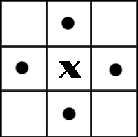
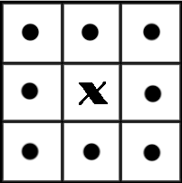
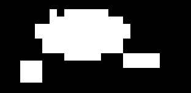

#开发记录

##一、基于形态学方法的目标检测
###1. 方案设计
基于形态学方法的目标检测主要分为三个步骤：  
1.区域选择->slide window/二值连通区域统计目标  
2.特征提取->形态学方法  
3.分类检测->svm  
###2. 算法介绍与实现  
####2.1 slide window简介  
滑动窗口(slide widow)是对于区域选择、区域提取最简单直接的办法。滑动窗口主要利用一个事先训练好的分类器，能够识别窗口内是否存在该目标物体，之后对于输入的图像设置不同大小的窗口，按照一定的步长进行滑动，直至遍历完整幅图像，根据分类器给每一个窗口的打分，保留包含物体的窗口，删除背景类的窗口，并且按照不同大小不同长宽比例的窗口进行筛选，最后保留下来的所有窗口，用非极大值抑制的算法（根据窗口的打分，去除一些与高得分窗口重叠度比较高的区域窗口），去除一些重叠的区域，最后剩下的就是提取的目标。  

滑动窗口的方法简单且易于理解，但是对不同窗口大小进行图像全局搜索而导致效率十分低下，而且设计窗口大小时候还需要考虑物体的长宽比。所以，对于实时性要求较高一般不使用滑窗法。  
####2.2 二值连通区域目标统计  

二值图像，顾名思义就是图像的亮度值只有两个状态：黑(0)和白(255)。二值图像在图像分析与识别中有着举足轻重的地位，因为其模式简单，对像素在空间上的关系有着极强的表现力。在实际应用中，很多图像的分析最终都转换为二值图像的分析，比如：医学图像分析、前景检测、字符识别，形状识别。二值化+数学形态学能解决很多计算机识别工程中目标提取的问题。  

二值图像分析最重要的方法就是连通区域标记，它是所有二值图像分析的基础，它通过对二值图像中白色像素（目标）的标记，让每个单独的连通区域形成一个被标识的块，进一步的我们就可以获取这些块的轮廓、外接矩形、质心、不变矩等几何参数。  

在图像中，最小的单位是像素，每个像素周围有8个邻接像素，常见的邻接关系有2种：4邻接与8邻接。4邻接一共4个点，即上下左右，如下左图所示。8邻接的点一共有8个，包括了对角线位置的点，如下图所示。  

   

如果像素点A与B邻接，我们称A与B连通，于是我们不加证明的有如下的结论：
如果A与B连通，B与C连通，则A与C连通。

在视觉上看来，彼此连通的点形成了一个区域，而不连通的点形成了不同的区域。这样的一个所有的点彼此连通点构成的集合，我们称为一个连通区域。下面这符图中，如果考虑4邻接，则有3个连通区域；如果考虑8邻接，则有2个连通区域。（注：图像是被放大的效果，图像正方形实际只有4个像素）  

  

参考链接：https://www.cnblogs.com/ronny/p/img_aly_01.html  

连通区域标记算法有很多种，有的算法可以一次遍历图像完成标记，有的则需要2次或更多次遍历图像。这也就造成了不同的算法时间效率的差别，在这里我们介绍2种算法。

第一种算法是现在matlab中连通区域标记函数bwlabel中使的算法，它一次遍历图像，并记下每一行（或列）中连续的团（run）和标记的等价对，然后通过等价对对原来的图像进行重新标记，这个算法是目前我尝试的几个中效率最高的一个，但是算法里用到了稀疏矩阵与Dulmage-Mendelsohn分解算法用来消除等价对，这部分原理比较麻烦，所以不介绍这个分解算法，取而代这的用图的深度优先遍历来替换等价对。

第二种算法是现在开源库cvBlob中使用的标记算法，它通过定位连通区域的内外轮廓来标记整个图像，这个算法的核心是轮廓的搜索算法，这个我们将在下中详细介绍。这个算法相比与第一种方法效率上要低一些，但是在连通区域个数在100以内时，两者几乎无差别，当连通区域个数到了103数量级时，上面的算法会比该算法快10倍以上。  

基于行程的标记：
<block>

	step 1:逐行扫描图像，我们把每一行中连续的白色像素组成一个序列称为一个团(run)，  
	并记下它的起点start、它的终点end以及它所在的行号。

	step 2:对于除了第一行外的所有行里的团，如果它与前一行中的所有团都没有重合区域，则给它一个新的标号；  
	如果它仅与上一行中一个团有重合区域，则将上一行的那个团的标号赋给它；  
	如果它与上一行的2个以上的团有重叠区域，则给当前团赋一个相连团的最小标号，并将上一行的这几个团的标记写入等价对，说明它们属于一类。

	step 3:将等价对转换为等价序列，每一个序列需要给一相同的标号，因为它们都是等价的。从1开始，给每个等价序列一个标号。

	step 4:遍历开始团的标记，查找等价序列，给予它们新的标记。

	step 5:将每个团的标号填入标记图像中。

	step 6:结束。  

<block>  

