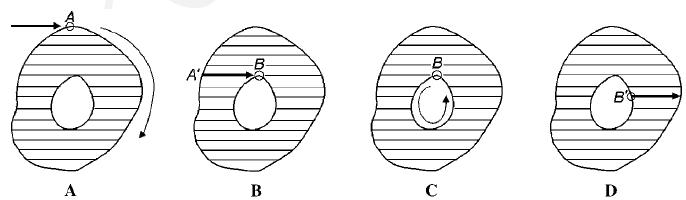
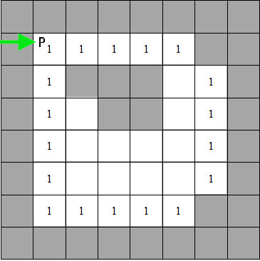
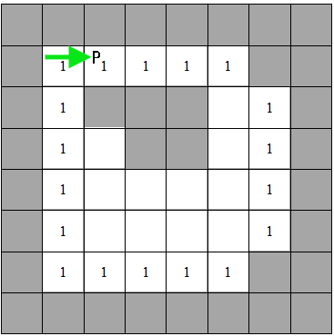
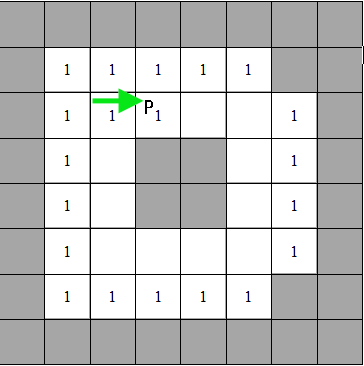
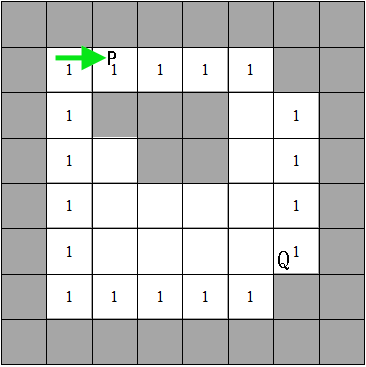
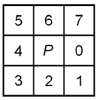
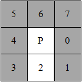
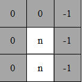
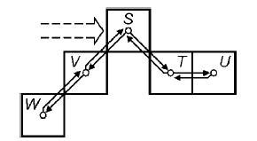

#开发记录

##一、基于形态学方法的目标检测
###1. 方案设计
基于形态学方法的目标检测主要分为三个步骤：  
1.区域选择->slide window/二值连通区域统计目标  
2.特征提取->形态学方法  
3.分类检测->svm  
###2. 算法介绍与实现  
####2.1 slide window简介  
滑动窗口(slide widow)是对于区域选择、区域提取最简单直接的办法。滑动窗口主要利用一个事先训练好的分类器，能够识别窗口内是否存在该目标物体，之后对于输入的图像设置不同大小的窗口，按照一定的步长进行滑动，直至遍历完整幅图像，根据分类器给每一个窗口的打分，保留包含物体的窗口，删除背景类的窗口，并且按照不同大小不同长宽比例的窗口进行筛选，最后保留下来的所有窗口，用非极大值抑制的算法（根据窗口的打分，去除一些与高得分窗口重叠度比较高的区域窗口），去除一些重叠的区域，最后剩下的就是提取的目标。  

滑动窗口的方法简单且易于理解，但是对不同窗口大小进行图像全局搜索而导致效率十分低下，而且设计窗口大小时候还需要考虑物体的长宽比。所以，对于实时性要求较高一般不使用滑窗法。  
####2.2 二值连通区域算法简介  

二值图像，顾名思义就是图像的亮度值只有两个状态：黑(0)和白(255)。二值图像在图像分析与识别中有着举足轻重的地位，因为其模式简单，对像素在空间上的关系有着极强的表现力。在实际应用中，很多图像的分析最终都转换为二值图像的分析，比如：医学图像分析、前景检测、字符识别，形状识别。二值化+数学形态学能解决很多计算机识别工程中目标提取的问题。  

二值图像分析最重要的方法就是连通区域标记，它是所有二值图像分析的基础，它通过对二值图像中白色像素（目标）的标记，让每个单独的连通区域形成一个被标识的块，进一步的我们就可以获取这些块的轮廓、外接矩形、质心、不变矩等几何参数。  

在图像中，最小的单位是像素，每个像素周围有8个邻接像素，常见的邻接关系有2种：4邻接与8邻接。4邻接一共4个点，即上下左右，如下左图所示。8邻接的点一共有8个，包括了对角线位置的点，如下图所示。  

   

如果像素点A与B邻接，我们称A与B连通，于是我们不加证明的有如下的结论：
如果A与B连通，B与C连通，则A与C连通。

在视觉上看来，彼此连通的点形成了一个区域，而不连通的点形成了不同的区域。这样的一个所有的点彼此连通点构成的集合，我们称为一个连通区域。下面这符图中，如果考虑4邻接，则有3个连通区域；如果考虑8邻接，则有2个连通区域。（注：图像是被放大的效果，图像正方形实际只有4个像素）  

  

参考链接：https://www.cnblogs.com/nsnow/p/4544115.html

连通区域标记算法有很多种，有的算法可以一次遍历图像完成标记，有的则需要2次或更多次遍历图像。这也就造成了不同的算法时间效率的差别，在这里我们介绍2种算法。

第一种算法是现在matlab中连通区域标记函数bwlabel中使的算法，它一次遍历图像，并记下每一行（或列）中连续的团（run）和标记的等价对，然后通过等价对对原来的图像进行重新标记，这个算法是目前我尝试的几个中效率最高的一个，但是算法里用到了稀疏矩阵与Dulmage-Mendelsohn分解算法用来消除等价对，这部分原理比较麻烦，所以不介绍这个分解算法，取而代这的用图的深度优先遍历来替换等价对。

第二种算法是现在开源库cvBlob中使用的标记算法，它通过定位连通区域的内外轮廓来标记整个图像，这个算法的核心是轮廓的搜索算法，这个我们将在下中详细介绍。这个算法相比与第一种方法效率上要低一些，但是在连通区域个数在100以内时，两者几乎无差别，当连通区域个数到了103数量级时，上面的算法会比该算法快10倍以上。  

基于行程的标记：
<block>

	step 1:逐行扫描图像，我们把每一行中连续的白色像素组成一个序列称为一个团(run)，  
	并记下它的起点start、它的终点end以及它所在的行号。

	step 2:对于除了第一行外的所有行里的团，如果它与前一行中的所有团都没有重合区域，则给它一个新的标号；  
	如果它仅与上一行中一个团有重合区域，则将上一行的那个团的标号赋给它；  
	如果它与上一行的2个以上的团有重叠区域，则给当前团赋一个相连团的最小标号，并将上一行的这几个团的标记写入等价对，说明它们属于一类。

	step 3:将等价对转换为等价序列，每一个序列需要给一相同的标号，因为它们都是等价的。从1开始，给每个等价序列一个标号。

	step 4:遍历开始团的标记，查找等价序列，给予它们新的标记。

	step 5:将每个团的标号填入标记图像中。

	step 6:结束。  

<block>  

基于轮廓的标记：  

<block>

	step 1:从上至下，从左至右依次遍历图像。

	step 2:如下图A所示，A为遇到一个外轮廓点（其实上遍历过程中第一个遇到的白点即为外轮廓点），且没有被标记过，则给A一个新的标记号。

	从A点出发，按照一定的规则,将A所在的外轮廓点全部跟踪到，然后回到A点，并将路径上的点全部标记为A的标号。

	step 3:如下图B所示，如果遇到已经标记过的外轮廓点A′,则从A′向右，将它右边的点都标记为A′的标号，直到遇到黑色像素为止。

	step 4:如下图C所示，如果遇到了一个已经被标记的点B，且是内轮廓的点(它的正下方像素为黑色像素且不在外轮廓上)，
	则从B点开始，跟踪内轮廓路径上的点都设置为B的标号，因为B已经被标记过与A相同，所以内轮廓与外轮廓将标记相同的标号。

	step 5:如下图D所示，如果遍历到内轮廓上的点，则也是用轮廓的标号去标记它右侧的点，直到遇到黑色像素为止。

	step 6:结束。

<block>

  

整个算法步骤，我们只扫描了一次图像，同时我们对图像中的像素进行标记，要么赋予一个新的标号，要么用它同行的左边的标号去标记它，下面是算法更详细的描述：  

对于一个需要标记的图像I，我们定义一个与它对应的标记图像L，用来保存标记信息，开始我们把L上的所有值设置为0，同时我们有一个标签变量C，初始化为1。然后我们开始扫描图像I，遇到白色像素时，设这个点为P点，我们需要按下面不同情况进行不同的处理：  

情况1：如果P(i,j)点是一个白色像素，在L图像上这个位置没有被标记过，而且P点的上方为黑色，则P是一个新的外轮廓的点，这时候我们将C的标签值标记给L图像上P点的位置(x,y),即L(x,y)=C,接着我们沿着P点开始做轮廓跟踪，并把把轮廓上的点对应的L上都标记为C，完成整个轮廓的搜索与标记后，回到了P点。最后不要忘了把C的值加1。这个过程如下面图像S1中所示。  

  

情况2：如果P点的下方的点是unmarked点（什么是unmark点，情况3介绍完就会给出定义），则P点一定是内轮廓上的点，这时候有两种情况，一种是P点在L上已经被标记过了，说明这个点同时也是外轮廓上的点；另一种情况是P点在L上还没有被标记过，那如果是按上面步骤来的，P点左边的点一定被标记了，所以这时候我们采用P点左边点的标记值来标记P，接着从P点开始跟踪内轮廓把内轮廓上的点都标记为P的标号。
下面图像显示了上面分析的两种P的情况，左图的P点既是外轮廓上的点也是内轮廓上的点。  

    

情况3：如果一个点P，不是上面两种情况之一，那么P点的左边一定被标记过,我们只需要用它左边的标号去标记L上的P点。
现在我们只剩下一个问题了，就是什么是unmarked点，我们知道内轮廓点开始点P的下方一定是一个黑色像素，是不是黑色像素就是unmarked点呢，显然不是，如下图像的Q点，它的下面也是黑色像素，然而它却不是内轮廓上的点。  
实际上在我们在轮廓跟踪时，我们我轮廓点的周围做了标记，在轮廓点周围被查找过的点（查找方式见下面的轮廓跟踪算法）在L上被标记了一个负值（如下面右图所示），所以Q点的下方被标记为了负值，这样Q的下方就不是一个unmarked点，unmarked点，即在L上的标号没有被修改过，即为0。  

   

显然，这个算法的重点在于轮廓的查找与标记，而对于轮廓的查找，就是确定搜索策略的问题，我们下面给内轮廓与外轮廓定义tracker规则。
我们对一点像素点周围的8个点分析作一个标号0-7，因为我们在遍历图像中第一个遇到的点肯定是外轮廓点，所以我们先来确定外轮廓的搜索策略，对于外轮廓的点P，有两种情况：  

   

1）如果P是外轮廓的起点，也就是说我们是从P点开始跟踪的，那么我们从7号（右上角）位置P1开始，看7号是不是白色点，如果是，则把这个点加入外轮廓点中，并将它标记与P点相同，如果7号点是黑色点，则按顺时针7-0-1-2-3-4-5-6这个顺序搜索直到遇到白点为止，把那个点确定为P1,加入外轮廓，并把这个点的标号设置与P点相同。这里很重要一步就是，假设我们2号点才是白点，那么7，0，1这三个位置我们都搜索过，所以我们要把这些点在L上标记为一个负值。如下图所示，其中右图像标记的结果。 

        

2）那么如果P是不是外轮廓的起点，即P是外轮廓路径上的一个点，那么它肯定是由一个点进入的，我们设置为P−1点，P−1点的位置为x(0<=x<=7)，那么P点从(x+2)mod8这个位置开始寻找下一步的路径，(x+2)mod8是加2取模的意思，它反映在图像就是从P-1点按顺时针数2个格子的位置。确定搜索起点后，按照上面一种情况进行下面的步骤。  
外轮廓点的跟踪方式确定了后，内轮廓点的跟踪方式大同小异，只是如果P是内轮廓的第一个点，则它的开始搜索位置不是7号点而是3号点。其他的与外轮廓完全一致。
如要上面搜索方式，你不是很直观的理解，不妨尝试着去搜索下面这幅图像，你应该有能有明确的了解了。一个路径搜索结束的条件是，回到原始点S，则S周围不存在unmarked点。
如下边中间图像所示，从S点开始形成的路径是STUTSVWV。  

  

####2.3二值连通算法实现  

SciKit-Image是一种Python下的图像处理工具包，scikit-image — Image processing in Python：Official Site   
在skimage包中，使用measure子模块下的label函数即可实现连通区域标记。 
参数input表示需要处理的二值图像，connectivity表示判定连通的模式（1代表4连通，2代表8连通），输出labels为一个从0开始的标记数组。  

	skimage.measure.label(input, neighbors = None, background = None, return_num = False, connectivity = None)  

Parameters:  
 
	@input : Image to label [ndarray of dtype int]   
	@neighbors : Deprecated, use @connectivity instead [{4, 8}, int, optional]   
	@background : Consider all pixels with this value as background pixels, and label them as 0.   
	By default, 0-valued pixels are considered as background pixels. [int, optional]   
	@return_num : Whether to return the number of assigned labels [bool, optional]   
	@connectivity : Maximum number of orthogonal hops to consider a pixel/voxel as a neighbor.   
	Accepted values are ranging from 1 to input.ndim. If None, a full connectivity of input.ndim is used. [int, optional]   
Returns:  
 
	@labels : Labeled array, where all connected regions are assigned the same integer value. [ndarray of dtype int]   
	@num : Number of labels, which equals the maximum label index and is only returned if return_num is True. [int, optional]  

example：  
<block>

	>>> import numpy as np
	>>> x = np.eye(3).astype(int)
	>>> print(x)
	[[1 0 0]
	 [0 1 0]
	 [0 0 1]]
	>>> print(label(x, connectivity = 1))
	[[1 0 0]
	 [0 2 0]
	 [0 0 3]]
	>>> print(label(x, connectivity = 2))
	[[1 0 0]
	 [0 1 0]
	 [0 0 1]]
	>>> print(label(x, background = -1))
	[[1 2 2]
	 [2 1 2]
	 [2 2 1]]
	>>> x = np.array([[1, 0, 0],
	...               [1, 1, 5],
	...               [0, 0, 0]])
	>>> print(label(x))
	[[1 0 0]
	 [1 1 2]
	 [0 0 0]]  
<block>

此外，使用measure子模块中的regionprops()函数可以很方便地对每一个连通区域进行属性获取和操作，比如计算面积、外接矩形、凸包面积等等。   
计算结果返回为所有连通区域的属性列表，列表长度为连通区域个数（第i个连通区域的attribute属性可以通过properties[i].attribute获取）。  

	skimage.measure.regionprops(label<u>_</u>image, intensity_image = None, cache = True)  
Parameters reference：https://blog.csdn.net/jkwwwwwwwwww/article/details/54381298  

example:  

	>>> from skimage import data, util
	>>> from skimage.measure import label
	>>> img = util.img_as_ubyte(data.coins()) > 110
	>>> label_img = label(img, connectivity = img.ndim)
	>>> props = regionprops(label_img)
	>>> # centroid of first labeled object
	>>> props[0].centroid
	(22.729879860483141, 81.912285234465827)
	>>> # centroid of first labeled object
	>>> props[0]['centroid']
	(22.729879860483141, 81.912285234465827)  
###3.canny算子
  

